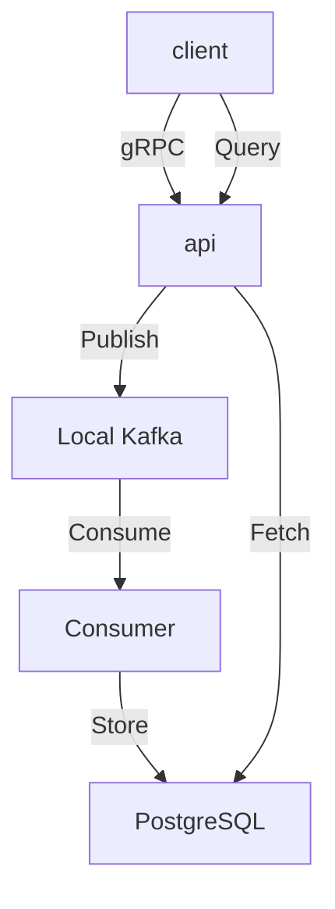

# terrarium
Data processing ecosystem for experiments.



System components built Rust.

* gRPC API server
* Kafka
* Kafka consumer
* load test client (TODO)
* terraform for running & deploying (TODO)
* .. and more

# Run it

1. `make deps` to start the dependencies (Kafka and PostgreSQL)
   - Use `make deps-down` when you're done to stop and clean up containers
2. `make run` to start API server
3. `make consumer` to start the Kafka consumer
   The consumer reads its configuration from `consumer/config.json` which specifies:
   - Kafka broker address
   - Consumer group ID
   - Topic to consume from

   The consumer will automatically handle graceful shutdown on Ctrl+C.

4. Optionally, you can also listen for messages directly inside the Kafka Docker container:
   ```
   kafka-console-consumer --offset earliest --partition 0 --topic default-topic --bootstrap-server kafka:9092
   ```

5. Send a request to the API to say hello and write a message.

```
grpcurl -plaintext \
  -d '{"name": "Bob"}' \
  localhost:50051 \
  hello.HelloApi/SayHello
```

6. Send a request to read past messages.

```
grpcurl -plaintext \
  -d '{"topic": "default-topic", "limit": 10}' \
  localhost:50051 \
  hello.HelloApi/GetMessages
```

7. Send a request to publish data using the new Publish RPC.

```
grpcurl -plaintext \
  -d '{"data": "This is some interesting data", "metadata": "Additional information about the data"}' \
  localhost:50051 \
  hello.HelloApi/Publish
```

8. Retrieve published data using the GetPublishes RPC.

```
grpcurl -plaintext \
  -d '{"limit": 10, "filter": "interesting"}' \
  localhost:50051 \
  hello.HelloApi/GetPublishes
```

You can also listen for messages on the new publish topic:
```
kafka-console-consumer --offset earliest --partition 0 --topic publish-topic --bootstrap-server kafka:9092
```
