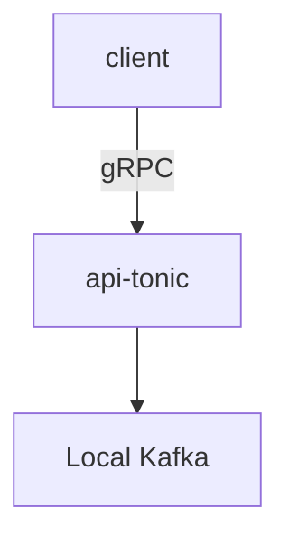

# terrarium
Data processing ecosystem for experiments.



System components built Rust. And later more languages.

* gRPC API server
* Kafka
* Kafka consumer
* load test client (TODO)
* terraform for running & deploying (TODO)
* .. and more

# Run it

1. `make run` to start API server
2. `make kafka` to start local Kafka
3. `make consumer` to start the Kafka consumer
   The consumer reads its configuration from `consumer/config.json` which specifies:
   - Kafka broker address
   - Consumer group ID
   - Topic to consume from

   The consumer will automatically handle graceful shutdown on Ctrl+C.

4. Optionally, you can also listen for messages directly inside the Kafka Docker container:
   ```
   kafka-console-consumer --offset earliest --partition 0 --topic default-topic --bootstrap-server kafka:9092
   ```

5. Send a request to the API

```
grpcurl -plaintext \
  -d '{"name": "Bob"}' \
  localhost:50051 \
  hello.HelloApi/SayHello
```
