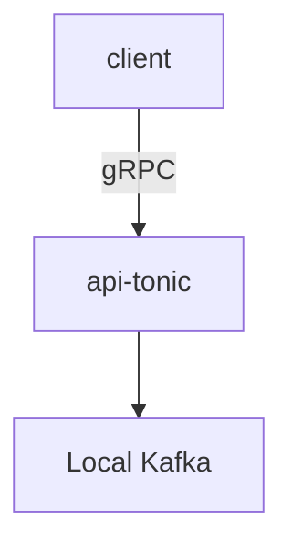

# terrarium
Data processing ecosystem for experiments.



System components built Rust. And later more languages.

* gRPC API server
* Kafka
* Kafka consumer (TODO)
* load test client (TODO)
* terraform for running & deploying (TODO)
* .. and more

# Run it

1. start the API in `rust/` using the `README.md`
2. start kafka within `local/`: `docker-compose -f docker-compose.kafka.yaml up`
3. send a request to the API (see step 1 `README.md`)
4. look for messages in kafka container:

```
kafka-console-consumer --offset earliest --partition 0 --topic default-topic --bootstrap-server kafka:9092
```
