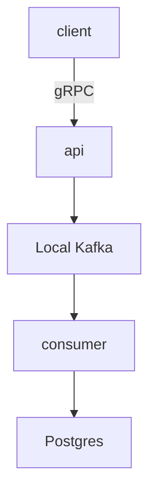

# terrarium
Data processing ecosystem for experiments.


```mermaid
flowchart TD
    A[client] -->|gRPC| B[api]
    B --> C[Local Kafka]
    C --> D[consumer]
    D --> E[Postgres]
```

System components built Rust.

* gRPC API server
* Kafka
* Kafka consumer
* Postgres database
* Prometheus metrics endpoints (API + consumer)
* Grafana dashboard (local)
* load test client (TODO)
* terraform for running & deploying (TODO)
* .. and more

## Run it

1. Start infra (Kafka, Postgres, Prometheus, Grafana):

```bash
cd local
docker compose up -d
cd ..
```

2. Start the consumer:

```bash
cd consumer
cargo run
```

3. Start the API server:

```bash
cd ../api
cargo run --bin helloworld-server
```

4. Send a request to the API to say hello and write a message.

```bash
grpcurl -plaintext \
  -d '{"name": "Bob"}' \
  localhost:50051 \
  hello.HelloApi/SayHello
```

5. Send a request to read past messages.

```bash
grpcurl -plaintext \
  -d '{"topic": "default-topic", "limit": 10}' \
  localhost:50051 \
  hello.HelloApi/GetMessages
```

## Monitoring & dashboards

With the API and consumer running:

- **Prometheus** (scrapes metrics from the host):
  - UI: http://localhost:9090

- **Grafana** (default admin/admin):
  - UI: http://localhost:3000
  - Add a Prometheus data source pointing to `http://prometheus:9090`.
  - Build dashboards using:
    - `api_messages_published_total`
    - `consumer_messages_total`
    - `consumer_db_insert_failures_total`
    - `consumer_end_to_end_latency_seconds`

- **API metrics:** http://localhost:9000/metrics
- **API dashboard:** http://localhost:9000/dashboard

- **Consumer metrics:** http://localhost:9100/metrics
- **Consumer dashboard:** http://localhost:9100/dashboard
